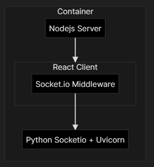

# Metacad Gym Environment
Usage:
1. Build Docker Container
```
/gym-metacad# Docker build -f gym_server.dockerfile -t <build_name> .
```
2. Connect to docker container
3. To use in Python (Tested on 3.9)
```
import gym
env = gym.make('gym_metacad:metacad-v0')
```

[OpenAI Gym Documentation](https://gym.openai.com/)

### Web Client Implementation:

socket.io logger as Thunk middleware hardcoded through ws://localhost:3001 picked up by python-socketio and eventlet WSGI (Web interface)

Connection tracks to window.location.hostname (from the browser's perspective on 3001)

## Backwards Direction

* SocketIO (Python) <- Socket.io <- React Client



## Forwards Direction
* Gym <-> Pyppeteer <-> Chrome Headless <- React
[Pyppeteer](https://pypi.org/project/pyppeteer/)
The initial idea of using OpenAI's Universe technology was scrapped with the realization that the overall complexity was far higher than anticipated. 
[Pyppeteer](https://miyakogi.github.io/pyppeteer/reference.html) was found as an appropriate substitute, based on the Nodejs API for Chrome [Puppeteer](https://developers.google.com/web/tools/puppeteer) , browser task automation was achieved.


## Putting it all together


## Further Development
We chose to convert Eventlet based programming into asyncio/uvicorn code to reduce dependency count and because of both of their presence in sample code. 

Pyppeteer should allow us to provide screencasting: 
[How to screencast with just Puppeteer](https://docs.browserless.io/blog/2020/06/09/screencast.html)
[browserless docs](https://docs.browserless.io/) (fallback)

